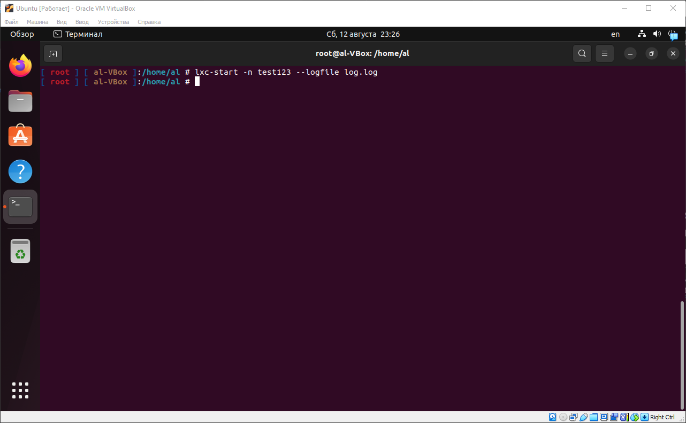

# Домашняя работа №2
## Механизмы контрольных групп
### Работа с LXC

1. Устанавливаем необходимые пакеты для работы с LXC;
    ```
    apt-get install lxc debootstrap bridge-utils lxc-templates
    ```
    
    

2. Устанавливаем LXD;
    ```
    apt-get install lxd-installer
    ```
    

3. Запускаем настройку LXD, где мы просто нажимаем Enter, чтобы использовать значения по умолчанию;
    ```
    lxd init
    ```
    

4. Проверяем список доступных хранилищ LXC;
    ```
    lxc storage list
    ```
    

5. Создаем контейнер с именем "test123" и используем шаблон Ubuntu. Опция -f указывает на конфигурационный файл, который определяет настройки виртуальной сети;
    ```
    lxc-create -n test123 -t ubuntu -f /usr/share/doc/lxc/example/lxc-veth.conf
    ```
    
    

6. Открываем конфигурационный файл контейнера "test123" для редактирования;
    ```
    nano /var/lib/lxc/test123/config
    ```
    
    

7. Ограничиваем максимальное количество памяти, которое может использовать контейнер до 256M;
    ```
    lxc.cgroup2.memory.max = 256M
    ```
    

8. Запускаем контейнер с именем "test123" в фоновом режиме;
    ```
    lxc-start -d -n test123
    ```
    

9. Подключаемся к контейнеру "test123";
    ```
    lxc-attach -n test123
    ```
    

10. Показываем использование памяти на хост-системе;
    ```
    free -m
    ```
    

11. Выходим из контейнера;
    ```
    exit
    ```
    

12. Проверяем список всех контейнеров, установленных на хост-системе;
    ```
    lxc-ls -f
    ```
    

13. Открываем конфигурационный файл контейнера "test123" для редактирования и указываем настройку, которая запускает контейнер автоматически при старте хост-системы;
    ```
    lxc.start.auto = 1
    ```
    

14. Останавливаем контейнер "test123";
    ```
    lxc-stop -n test123
    ```
    

15. Проверяем, что контейнер остановлен выведя список всех контейнеров, установленных на хост-системе;
    ```
    lxc-ls -f
    ```
    

16. Перезагружаем хост-систему;
    ```
    reboot
    ```
    

17. Убеждаемся, что контенер запустился автоматически;
    ```
    lxc-ls -f
    ```
    

18. Останавливаем контейнер "test123";
    ```
    lxc-stop -n test123
    ```
    

19. Запускаем контейнер "test123" и записываем логи в файл "log.log";
    ```
    lxc-start -n test123 --logfile log.log
    ```
    

20. Перезагружаем хост-систему;
    ```
    reboot
    ```
    

21. Убеждаемся, что логи записываются, т.к. после попытки его запустить, говорится, что конейнер уже запущен;
    ```
    lxc-start -n test123 --logfile log.log
    ```
    

22. Останавливаем контейнер "test123";
    ```
    lxc-stop -n test123
    ```
    

23. Удаляем контейнер "test123" с хост-системы.
    ```
    lxc-destroy -n test123
    ```
    