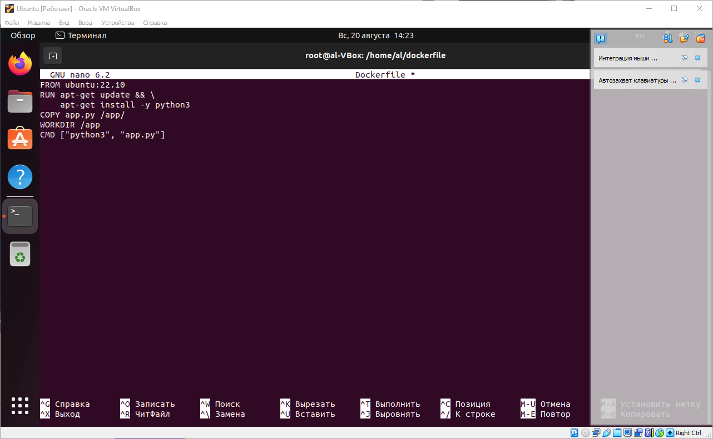

# Домашняя работа №3
## Dockerfile и слои
### Создание Dockerfile

1. Создаем python-файл;
    ```
    nano app.py
    ```
    

2. Прописываем код исполнения программы на python;
    ```
    # Последовательностью Фибоначчи называется
    # последовательность чисел a0, a1, ..., an, ..., где
    # a0 = 0, a1 = 1, ak = ak-1 + ak-2 (k > 1).
    # Требуется найти N-е число Фибоначчи
    # Input: 7
    # Output: 13
    # Задание необходимо решать через рекурсию

    def fib(k):
        if k in (0, 1):
            return k
        return fib(k - 1) + fib(k - 2)
    n = int(input('n = '))
    lst = []
    for i in range(n + 1):
        lst.append(fib((i)))
    idx = []
    for i in range(n + 1):
        idx.append((i))
    print(*lst, sep='\t', end=' Последовательность Фибоначчи \n')
    print(*idx, sep='\t', end=' Индекс чисел Фибоначчи \n')
    print(fib(n))
    ```
    

3. Создаем Dockerfile;
    ```
    nano Dockerfile
    ```
    

4. Прописываем инструкции в несколько слоев (в нашем случае 4);
    ```
    FROM ubuntu:22.10
    RUN apt-get update && \
        apt-get install -y python3
    COPY app.py /app/
    WORKDIR /app
    CMD ["python3", "app.py"]
    ```
    

5. Собираем докерфайл;
    ```
    docker build -t app-python .
    ```
    
    

6. Запускаем контейнер из созданного образа;
    ```
    docker run -it app-python
    ```
    
    