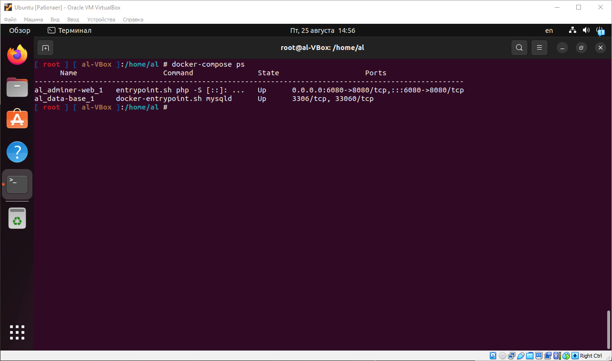

# Домашняя работа №5
## Docker Compose и Docker Swarm
### Создание сервиса, состоящего из 2 различных контейнеров: 1 - веб, 2 - БД (compose)

1. Создаем и открываем для изменения файл docker-compose.yaml;
    ```
    nano docker-compose.yaml
    ```
    

2. Прописываем сервисы;
    ```
    version: '3.9'
    services:

        adminer-web:
            image: adminer:4.8.1
            restart: always
            ports:
                - "6080:8080"

        data-base:
            image: mysql:8.0.31
            restart: always
            environment:
                MYSQL_ROOT_PASSWORD: 12345
    ```
    

3. Устанавиливаем docker-compose, в нашем случае уже установлен;
    ```
    apt install docker-compose
    ```
    
    

4. Запускаем проект в фоновом режиме;
    ```
    docker-compose up -d
    ```
    
    

5. Выводим на экран все доступные контейнеры;
    ```
    docker-compose ps
    ```
    

6. Проверяем работу в браузере, перейдя по адресу:
    ```
    http://localhost:6080/
    ```
    
    